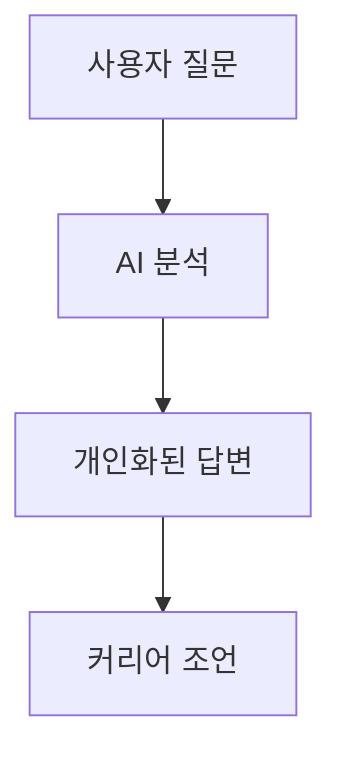

# G-Navi Frontend

G-Navi는 AI 기반 커리어 내비게이션 서비스의 프론트엔드 애플리케이션입니다. 개인 맞춤형 커리어 컨설팅과 성장 전략을 제공하는 현대적인 웹 애플리케이션입니다.

## 🚀 주요 기능

### 사용자 기능
- **AI 채팅 컨설팅**: 개인 역량 분석 및 커리어 조언
- **프로필 관리**: 레벨, 스킬, 프로젝트 경험 관리
- **인사이트 카드**: 최신 업계 뉴스 및 트렌드 제공
- **대화 기록**: 과거 상담 내용 저장 및 관리

### 전문가 기능
- **콘텐츠 등록**: 인사이트 카드 콘텐츠 제출
- **전문 상담**: 고급 커리어 컨설팅 제공

### 관리자 기능
- **사용자 관리**: 전체 사용자 및 전문가 관리
- **콘텐츠 관리**: 뉴스/인사이트 승인 및 관리
- **대시보드**: 사용자 통계, 질문 분석, 워드클라우드
- **스킬 분석**: 레벨별 스킬 현황 및 트렌드 분석

## 🛠 기술 스택

### Core Technologies
- **React 19** - 최신 React 기능 활용
- **TypeScript** - 타입 안전성 보장
- **Vite** - 빠른 개발 환경 및 빌드

### Styling & UI
- **Tailwind CSS** - 유틸리티 우선 스타일링
- **CSS Modules** - 컴포넌트별 스타일 격리
- **Responsive Design** - 모바일 친화적 디자인

### State Management & Routing
- **Zustand** - 경량 상태 관리
- **React Router DOM v7.6.1** - 클라이언트 사이드 라우팅

### Data & API
- **Axios** - HTTP 클라이언트
- **Recharts** - 데이터 시각화
- **REST API** - 백엔드 통신

### Development Tools
- **ESLint** - 코드 품질 관리
- **Prettier** - 코드 포맷팅

### Deployment
- **Docker** - 컨테이너화
- **Kubernetes** - 오케스트레이션
- **Jenkins** - CI/CD 파이프라인

## 📁 프로젝트 구조

```
src/
├── api/                    # API 통신 관련
│   ├── admin.ts           # 관리자 API
│   ├── auth.ts            # 인증 API
│   ├── client.ts          # HTTP 클라이언트 설정
│   ├── conversation.ts    # 채팅 API
│   ├── news.ts           # 뉴스 API
│   ├── project.ts        # 프로젝트 API
│   └── wordcloud.ts      # 워드클라우드 API
├── components/            # 재사용 가능한 컴포넌트
│   ├── admin/            # 관리자 전용 컴포넌트
│   │   ├── Experts.tsx   # 전문가 관리
│   │   ├── News.tsx      # 뉴스 관리
│   │   └── dashboard/    # 대시보드 차트들
│   ├── common/           # 공통 컴포넌트
│   │   ├── CommonButton.tsx
│   │   ├── CommonInputField.tsx
│   │   ├── CommonTitle.tsx
│   │   └── Loading.tsx
│   ├── conversation/     # 채팅 관련 컴포넌트
│   │   ├── ConversationContent.tsx
│   │   ├── ConversationInput.tsx
│   │   ├── Message.tsx
│   │   └── RecommendationCards.tsx
│   ├── home/            # 홈페이지 컴포넌트
│   │   ├── HomeCard.tsx
│   │   └── HomeCardSkeleton.tsx
│   ├── layout/          # 레이아웃 컴포넌트
│   │   ├── Footer.tsx
│   │   ├── Header.tsx
│   │   ├── SideBar.tsx
│   │   └── SKButterflyBackground.tsx
│   └── profile/         # 프로필 관련 컴포넌트
│       ├── ProfileSection.tsx
│       ├── SkillSetSection.tsx
│       ├── ProjectSection.tsx
│       └── ProjectFormModal.tsx
├── layouts/              # 레이아웃 래퍼
│   └── MainLayout.tsx
├── pages/               # 페이지 컴포넌트
│   ├── HomePage.tsx     # 메인 페이지
│   ├── JoinPage.tsx     # 로그인/회원가입
│   ├── ConversationPage.tsx  # AI 채팅
│   ├── Mypage.tsx       # 마이페이지
│   ├── AdminPage.tsx    # 관리자 페이지
│   ├── ExpertPage.tsx   # 전문가 페이지
│   └── DashBoardPage.tsx # 대시보드
├── store/               # 상태 관리
│   └── authStore.ts     # 인증 상태
├── assets/              # 정적 자원
├── App.tsx              # 앱 루트 컴포넌트
├── main.tsx            # 앱 진입점
├── router.tsx          # 라우팅 설정
└── index.css           # 전역 스타일
```

## 🎯 사용자 역할 및 권한

### USER (일반 사용자)
- ✅ AI 채팅 상담
- ✅ 개인 프로필 관리
- ✅ 프로젝트/스킬 등록
- ✅ 인사이트 카드 조회

### EXPERT (전문가)
- ✅ 모든 USER 권한
- ✅ 인사이트 콘텐츠 등록
- ✅ 전문가 컨설팅 제공

### ADMIN (관리자)
- ✅ 사용자/전문가 관리
- ✅ 콘텐츠 승인/거절
- ✅ 통계 대시보드
- ✅ 워드클라우드 분석

## 🚦 시작하기

### 필수 조건
- Node.js >= 18.0.0
- npm

### 설치 및 실행

1. **저장소 복제**
   ```bash
   git clone <repository-url>
   cd g-navi-frontend/frontend
   ```

2. **의존성 설치**
   ```bash
   npm install
   ```

3. **환경 변수 설정**
   ```bash
   # .env 파일 생성
   VITE_API_BASE_URL=<백엔드_API_URL>
   ```

4. **개발 서버 실행**
   ```bash
   npm run dev
   ```
   일반적으로 `http://localhost:5173`에서 실행됩니다.

5. **프로덕션 빌드**
   ```bash
   npm run build
   ```

6. **코드 린팅**
   ```bash
   npm run lint
   ```

## 🎨 주요 컴포넌트

### 인증 시스템
- **authStore.ts**: Zustand 기반 인증 상태 관리
- **LoginForm/SignupForm**: 사용자 인증 폼
- **라우트 보호**: 역할 기반 접근 제어

### AI 채팅 시스템
- **ConversationPage**: 메인 채팅 인터페이스
- **Message**: 마크다운 지원, Mermaid 다이어그램 렌더링
- **RecommendationCards**: 추천 질문 카드

### 관리자 대시보드
- **StatsCards**: 주요 지표 카드
- **LevelCharts**: 사용자 레벨 분포 차트
- **SkillCharts**: 스킬 통계 분석
- **WordCloudCharts**: Canvas 기반 워드클라우드

### 프로필 관리
- **ProfileSection**: 사용자 정보 및 레벨 관리
- **ProjectSection**: 프로젝트 경험 관리
- **SkillSetSection**: 보유 스킬 표시

## 🔧 핵심 기능 상세

### 마크다운 지원
```typescript
// 메시지 컴포넌트에서 지원하는 마크다운 기능
- **볼드 텍스트**
- *이탤릭 텍스트*
- `인라인 코드`
- [링크](URL)
- 제목 (H1-H6)
- 리스트 (순서있음/없음)
- 코드 블록
- Mermaid 다이어그램
```

### Mermaid 다이어그램


### 상태 관리
```typescript
// Zustand를 사용한 간단하고 효율적인 상태 관리
interface AuthState {
  isLoggedIn: boolean;
  user: UserInfo | null;
  homeInfo: HomeInfo | null;
  login: (memberId, name, email, role, isExpert) => void;
  logout: () => void;
}
```

## 🎯 개발 가이드라인

### 코딩 컨벤션
- **TypeScript**: 모든 코드에 타입 정의
- **컴포넌트**: PascalCase (예: `CommonButton.tsx`)
- **파일**: 컴포넌트는 PascalCase, 유틸리티는 camelCase
- **CSS**: Tailwind 유틸리티 클래스 우선 사용

### 컴포넌트 설계 원칙
- **재사용성**: 공통 컴포넌트 최대 활용
- **단일 책임**: 각 컴포넌트는 하나의 역할
- **Props 타입 정의**: 모든 Props에 TypeScript 인터페이스
- **접근성**: ARIA 속성 및 시맨틱 HTML 사용

### API 통신 패턴
```typescript
// 중앙 집중식 API 클라이언트
export const api = {
  get: <T>(endpoint: string, config?: AxiosRequestConfig): Promise<T>,
  post: <T>(endpoint: string, data?: any, config?: AxiosRequestConfig): Promise<T>,
  // ... 기타 HTTP 메서드
};
```

## 🐳 Docker 배포

### 로컬 Docker 실행
```bash
# 프로젝트 루트에서 실행
docker build -t g-navi-frontend .
docker run -p 80:80 g-navi-frontend
```

### Kubernetes 배포
```bash
# Kubernetes 리소스 적용
kubectl apply -f k8s/deploy.yaml
kubectl apply -f k8s/service.yaml
```

## 🔄 CI/CD 파이프라인

Jenkins 파이프라인을 통한 자동 배포:

1. **소스 코드 체크아웃**
2. **Docker 이미지 빌드**
3. **Harbor 레지스트리 푸시**
4. **Kubernetes 배포**

## 🎨 디자인 시스템

### 색상 팔레트
```css
:root {
  --main-color: #122250;
  --text-color: #1E293B;
  --brand-indigo: #6366f1;
  --brand-purple: #a855f7;
  --brand-blue: #3b82f6;
  --brand-pink: #ec4899;
}
```

### 글래스모피즘 디자인
- 반투명 배경 효과
- 블러 효과 적용
- 그라데이션 배경
- 부드러운 애니메이션

## 📱 반응형 디자인

- **Mobile First**: 모바일 우선 설계
- **Breakpoints**: Tailwind CSS 브레이크포인트 활용
- **Flexible Grid**: CSS Grid 및 Flexbox 사용
- **Touch Friendly**: 모바일 인터랙션 최적화

## 🔍 성능 최적화

- **Code Splitting**: React.lazy 및 동적 import
- **Image Optimization**: 적절한 이미지 포맷 및 크기
- **Bundle Optimization**: Vite 최적화 설정
- **Caching**: 적절한 HTTP 캐싱 헤더

## 🧪 테스팅

```bash
# 린트 검사
npm run lint

# 타입 체크
npx tsc --noEmit
```

## 📈 모니터링

- **에러 추적**: 프로덕션 환경 에러 모니터링
- **성능 모니터링**: 로딩 시간 및 사용자 경험 추적
- **사용자 분석**: 주요 기능 사용 패턴 분석

## 🤝 기여하기

1. Fork the repository
2. Create a feature branch (`git checkout -b feature/amazing-feature`)
3. Commit your changes (`git commit -m 'Add amazing feature'`)
4. Push to the branch (`git push origin feature/amazing-feature`)
5. Open a Pull Request

## 📄 라이센스

© 2025 G-Navi. All rights reserved.

## 📞 지원

문제가 발생하거나 질문이 있으시면 개발팀에 문의해주세요.

---

**G-Navi Frontend** - AI 기반 커리어 내비게이션의 미래를 만들어갑니다. 🚀
